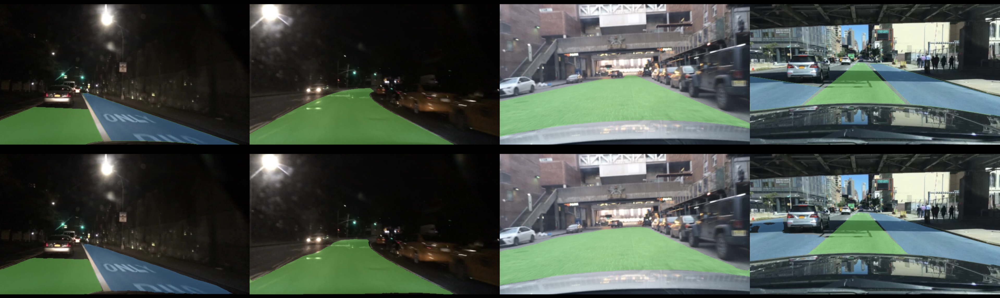

# berkeley_deep_drive_driveable_areas

Drivable areas segmentation model for [Berkeley DeepDrive dataset][berkeley_deep_drive].

Segmentation algorith is derived from [Encoder-Decoder with Atrous Separable Convolution for Semantic Image Segmentation][encoder_decoder_paper].

This project is based on my other segmentation project, [VOC encoder decoder][voc_encoder_decoder].

### Results

For each image below upper row shows groundh truth, and lower row shows predictions.

#### Good results

#### Average results

#### Failures

You can also see how model performs in the wild on data very different different from what it had seen during training in [this video][youtube_video].

Mean intersection over union of the best trained model for the validation dataset was **0.8486**, with performance on each category provided in table below.

Category | Intersection over union
--- | ---
alternative | 0.7335
background | 0.9754
direct | 0.8369

### How to run

A docker container is provided to run the project, along with a few helper host-side invoke tasks to start and manage the environment.
Almost every task accepts `--config-path` argument, a path to configuration file that defines paths to data, batch size to use, etc.
You can refer to `config.yaml` for a sample configuration file.

Host-side invoke tasks are:
- `docker.build_app_container` - builds main container inside which train, analysis, and visualization tasks can be run
- `docker.run` - runs app container

You can also mlflow and nginx containers for logging and displaying results with `docker-compose`.

Inside the container, the most important `invoke` tasks are:
- `ml.train` - trains model
- `analyze.analyze-predictions` - computes mean intersection over union of ground truth segmentations and model predictions
- `visualize.visualize-predictions` - visualizes model predictions

[encoder_decoder_paper]: https://arxiv.org/abs/1802.02611
[berkeley_deep_drive]: https://bdd-data.berkeley.edu/
[youtube_video]: https://www.youtube.com/watch?v=GEF-py4_59I
[voc_encoder_decoder]: https://github.com/PuchatekwSzortach/voc_encoder_decoder_with_atrous_separable_convolutions/
